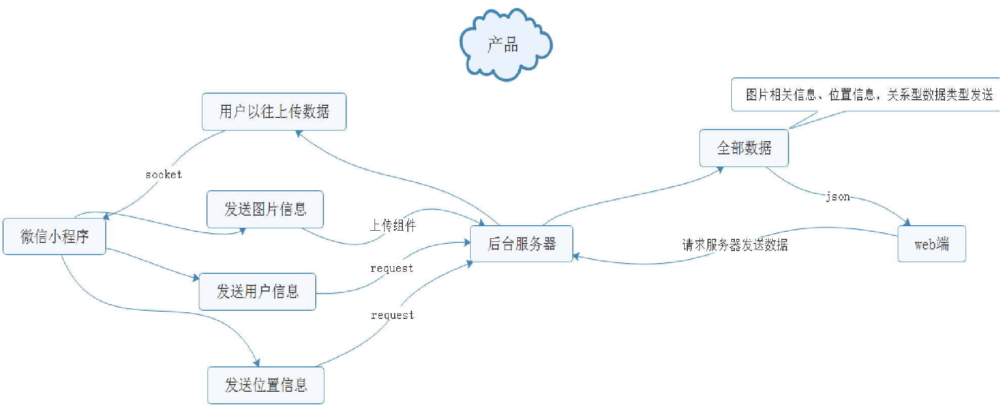
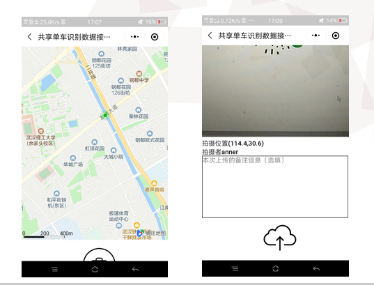
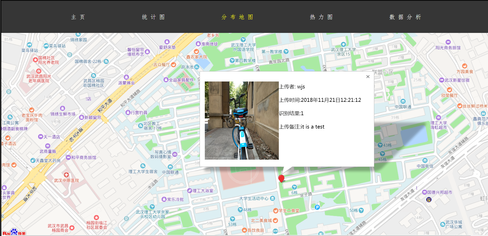
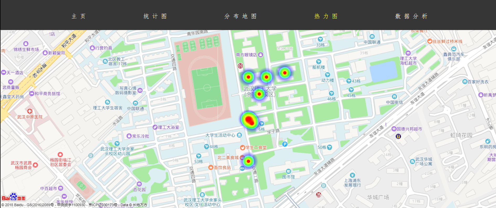
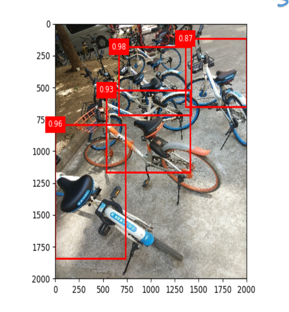

## 介绍

共享单车校园停放可视化调查

本项目以应用程序为前端收集图片（提供监控视频选择性提取图片的功能），使用java后台处理信息，使用计算机视觉算法处理图片，最后通过网页形式显示图像处理效果，实现可视化统计和显示。

##  微信小程序

微信小程序实现采集校园内单车的照片

微信小程序截图:

## 后台框架

后台使用spring框架处理微信程序的请求和响应展示页面的请求

页面渲染使用传统的html+css+js

## 网页展示

## 共享单车识别算法

使用SSD物体检测算法识别共享单车数量

[ssd算法原理](https://www.dlcv.wang/2019/04/04/ssd/)

[ssd代码和训练模型](https://github.com/anner-wang/personalized-driving/tree/master/ssd)

识别效果（最新识别效果后面更新）:

